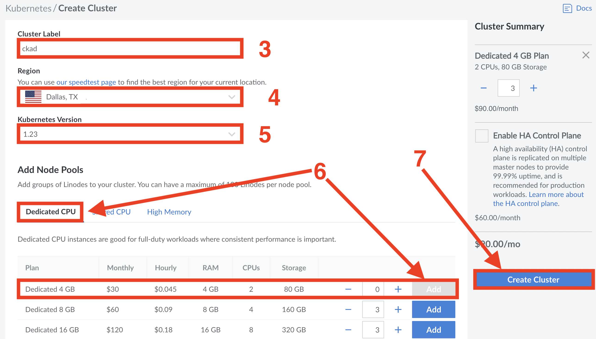

# README

Welcome to the CKAD Exam Cram workshop!

Complete the following sections to build a lab environment. The steps may look complicated, but they're not.

1. Install `kubectl` and `git`
2. Sign-up to Linode ($100 free credit included)
3. Create a Kubernetes cluster on Linode
4. Connect to your Kubernetes cluster
5. Build your lab environment
6. Clean-up

## 1. Install `kubectl` and `git`

**Install kubectl**

- Instructions for [Mac](https://kubernetes.io/docs/tasks/tools/install-kubectl-macos/#install-with-homebrew-on-macos)

- Instructions for [Windows](https://kubernetes.io/docs/tasks/tools/install-kubectl-windows/#install-kubectl-on-windows)

**Install git**

- MacOS: `brew install git`

- Windows: Download the installation exe from [here](https://git-scm.com/download/win) and follow the installation wizard.

You should quit and re-open your terminal.

## 2. Sign-up to Linode

Go to [linode.com](https://login.linode.com/signup?promo=kubeconna2022NP) and complete your sign-up. This link includes $100 of free credit to pay for your cluster during the workshop.

## 3. Create a Kubernetes cluster on Linode

You must be logged in to linode.com to complete the following steps.

1. Select **Kubernetes** on the left-hand navigation pane
2. Choose `Create Cluster` and set the following options
3. **Cluster label:** Give your cluster a name such as **ckad**
4. **Region:** Dallas, TX 
5. **Kubernetes Version:** 1.23
6. **Add Node Pools:**  Click `Dedicated CPU` and click the blue `Add` button at the end of the **Dedicated 4 GB** line (this will add 3 x 4GB nodes)
7. When your settings match the image below, click `Create Cluster`



It may take a couple of minutes for your cluster to be ready.

## 4. Connect to your Kubernetes cluster

You must be logged in to linode.com to complete the following steps.

1. Click **Kubernetes** on the left-hand navigation pane
2. Click the `Download kubeconfig` link for your cluster (the download will fail if your cluster is still being created)
3. Copy the downloaded file to the hidden `./kube` folder in your home directory
    - If you already have a file called `config` in your hidden `./kube` folder, rename the existing file to `config.bkp`
    - Rename the file you just downloaded from Linode and copied to your hidden `./kube` folder to `config`. Be sure the file is called `config` and **not** something like `config.yml`.
4. Open a terminal and type the following command. Your output should look similar

```
kubectl get nodes
NAME                           STATUS   ROLES    AGE     VERSION
lke76472-118784-634d2eb30838   Ready    <none>   5m23s   v1.23.6
lke76472-118784-634d2eb32f20   Ready    <none>   5m21s   v1.23.6
lke76472-118784-634d2eb354b1   Ready    <none>   4m51s   v1.23.6
```

**Congratulations, you're connected to your Kubernetes cluster.**

## 5. Build your lab environment

Open a terminal and run the following commands to build your lab environment.

You must have `kubectl` and `git` installed to complete these steps. You must also be connected to the Kubernetes cluster you just created on Linode.

**5.1 Deploy an NGINX ingress controller**

```
kubectl apply -f https://raw.githubusercontent.com/kubernetes/ingress-nginx/controller-v1.3.0/deploy/static/provider/cloud/deploy.yaml
```

**5.2 Clone the lab configuration files from GitHub**

It is recommended to run the following command from the root of your home folder or a temp directory.

```
git clone https://github.com/nigelpoulton/ckad-exam-cram.git
```

**5.3 Change into the 'ckad-exam-cram' directory**

```
cd ckad-exam-cram
```

**5.4 Build your lab**

Run the following command from within the `ckad-exam-cram` directory.

```
kubectl apply -f ckad-lab.yml
```

If the command returns an error deploying the `app.com` Ingress resource, wait a couple of minutes and run the command again. This happens if the NGINX controller is still installing.

**5.5 Check your lab**

Run the following commands. If your outputs look the same, your lab is ready to go.

```
kubectl get ingressclass
NAME    CONTROLLER             PARAMETERS   AGE
nginx   k8s.io/ingress-nginx   <none>       4m
```

```
kubectl get ns
NAME              STATUS   AGE
ckad-cram         Active   33s
ckad-ftw          Active   30s
ckad002           Active   34s
ckad003           Active   33s
cram001           Active   34s
db001             Active   32s
default           Active   93m
detroit           Active   31s
exam-ckad         Active   34s
ingress-nginx     Active   86m
kube-node-lease   Active   93m
kube-public       Active   93m
kube-system       Active   93m
kubecon           Active   31s
pluralsight       Active   35s
sa001             Active   32s
```

## 6. Clean-up

Run the following steps after the workshop is finished to shut down your lab and return to your pre-lab settings.

**Delete Kubernetes resources**

Run the following commands from the root folder of the git repo. If you followed the instructions, this will be the `ckad-exam-cram` folder.

```
kubectl delete -f ckad-lab.yml
<Resources being deleted>

kubectl delete -f https://raw.githubusercontent.com/kubernetes/ingress-nginx/controller-v1.3.0/deploy/static/provider/cloud/deploy.yaml
<Resources being deleted>
```

**Delete your Kubernetes cluster**

You must be logged in to Linode.com to complete these steps.

1. Click `Kubernetes` in the left navigation pane. Your cluster will be listed.
2. Click the `Delete` button on the far right of your cluster and follow the prompts. If you have other clusters, be sure to delete the cluster used for the workshop. You may be prompted to type the name of your cluster as confirmation of the operation.

**Delete other Linode resources**

Previous steps should have deleted all resouces created as part of the lab. The following steps are intended to catch any resources not deleted by previous steps.

1. Click `NodeBalancers` and delete any NodeBalancers created as part of the lab.
2. Click `Volumes` and clik the three dots to the far right of each volume created as part of the workshop. Choose `Delete` from the list and follo the prompts.

**Revert your `kubeconfig`**

If you already had `kubectl` installed, you will need to revert to your saved `kubeconfig` file.

1. Navigate to the hidden `./kube` folder in your home folder
2. Delete the file called `config`
3. Rename the `config.bkp` file to `config`

Your `kubeconfig` is now reverted to it's pre-workshop configuration.
